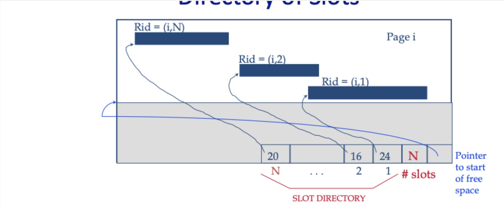

## Project 1 Report

### 1. Basic information

- Team #: Yufan Zhao
- Github Repo Link:https://github.com/UCI-Chenli-teaching/cs222p-winter23-nidepapa
- Student 1 UCI NetID: 88127297
- Student 1 Name: yufan zhao

### 2. Internal Record Format

- Show your record format design.
  

| AttrNum | Null Flags | Attr Directory    | Attr Values |
|---------|------------|-------------------|-------------|
| 2 byte  | Variable   | 2 * Attr Num byte | Variable    |

1. AttrNum: number of attribute
2. Attr Directory: an array of pointer, each pointer points to the ending byte of that attribute, it will be -1 for null 
3. Attr Value: concatenation of all attribute value in byte sequence

- Describe how you store a null field.
    1. the value in Attr Directory for a null field would be -1

- Describe how you store a VarChar field.
    1. Save all char in VarChar field directly and store a pointer pointing to the end

- Describe how your record design satisfies O(1) field access.
    1. Once given a field index, we can easily get the ending position of that field from Attr Directory.
       Then the field data is the byte in [last_ending_pos, this_ending_pos]. And this operation is O(1) time
       complexity.
       PS: initially, [last_ending_pos] is the ending position of [Attr Directory].

### 3. Page Format

- Show your page format design.
  

- Explain your slot directory design if applicable.
    1. Slot directory is a 2-d array, and each element represents a tuple of 2 shorts < record_beginning_pos,
       record_length>

### 4. Page Management

- Show your algorithm of finding next available-space page when inserting a record.
    1. check if last page has enough free space, if it does , insert directly
    2. Traverse all pages from last page to page 0 sequentially and return the first available page number
  3If no present available page, then append a new page and insert record

- How many hidden pages are utilized in your design?
    1. Only 1

- Show your hidden page(s) format design if applicable

| pageCounter | readPageCounter | writePageCounter | appendPageCounter |
|-------------|-----------------|------------------|-------------------|
| 4 byte      | 4 byte          | 4 byte           | 4 byte            |

### 5. Implementation Detail
- I designed two helper class in OOD.
  1. PageHelper: all operations that related to an exact page is done by this class like updating page metadata
  2. RecordHelper: all operations that related to an exact page is done by this class like formatting raw data

### 6. Member contribution (for team of two)

- N/A

### 7. Other (optional)

- Freely use this section to tell us about things that are related to the project 1, but not related to the other
  sections (optional)

- Feedback on the project to help improve the project. (optional)