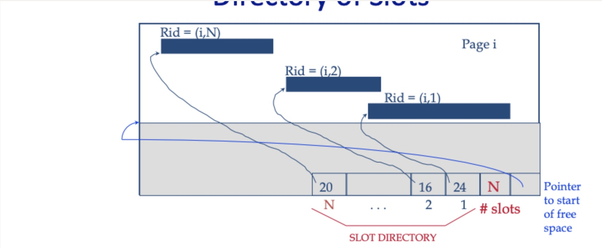

## Project 2 Report

### 1. Basic information

- Team #: Yufan Zhao
- Github Repo Link:https://github.com/UCI-Chenli-teaching/cs222p-winter23-nidepapa
- Student 1 UCI NetID: 88127297
- Student 1 Name: yufan zhao

### 2. Meta-data

- Show your meta-data design (Tables and Columns table) and information about each column.

| table_id | table_name  | file_name   | flag  |
|----------|-------------|-------------|-------|
| int      | varchar(50) | varchar(50) | short |

flag: 1 - system table 2 - user table

| table_id | column_name | column_type | column_length | column_position |
|----------|-------------|-------------|---------------|-----------------|
| int      | varchar(50) | int         | int           | int             |

### 3. Internal Record Format (in case you have changed from P1, please re-enter here)

- Show your record format design.

| Flag   | PlaceHolder | AttrNum | Attr Directory    | Attr Values                |
|--------|-------------|---------|-------------------|----------------------------|
| 1 byte | 1 byte      | 2 byte  | 2 * Attr Num byte | Variable (at least 1 byte) |

1. flag: 0-real record; 1-pointer
2. placeholder: since there is a possibility that we have to store a RID in tombstone
   the length must be >= 6 byte (4 + 2)

- Describe how you store a null field.
1. the corresponding Attr Directory offset will be set to -1

- Describe how you store a VarChar field.
1. Save all char in VarChar field directly and store a pointer pointing to the end

- Describe how your record design satisfies O(1) field access.
1. Once given a field index, we can easily get the ending position of that field from Attr Directory.
   Then the field data is the byte in [last_ending_pos, this_ending_pos]. And this operation is O(1) time
   complexity.
   PS: initially, [last_ending_pos] is the ending position of [Attr Directory].

### 4. Page Format (in case you have changed from P1, please re-enter here)

- Show your page format design.
  
-

- Explain your slot directory design if applicable.
    1. Slot directory is a 2-d array, and each element represents a tuple of 2 shorts < record_beginning_pos,
       record_length>

### 5. Page Management (in case you have changed from P1, please re-enter here)

- How many hidden pages are utilized in your design?
  only one

- Show your hidden page(s) format design if applicable

| pageCounter | readPageCounter | writePageCounter | appendPageCounter |
|-------------|-----------------|------------------|-------------------|
| 4 byte      | 4 byte          | 4 byte           | 4 byte            |

### 6. Describe the following operation logic.

- Delete a record
1. find the record with RID
2. delete the actual data byte and shift the rest data to the left
3. update slot table to <-1, 0> and freeByte pointer
   PS: slot which marked as -1 can be reused in the future

- Update a record
1. read catelog to get record descriptor
- case1: the new record is shorter
    1. find the actual old record
    2. overwrite the old record with new record
    3. shift the rest data to left by |old_length - new_length| byte
    4. update slot table and freeByte pointer

- case2: the new record is longer but can fit in the same page
    1. find the actual old record
    2. overwrite the old record with new record
    3. shift the rest data to right by |old_length - new_length| byte
    4. update slot table and freeByte pointer

- case3: the new record is longer but can not fit in the same page
    1. insert the new record to the next available page and get RID
    2. find the actual old record
    3. overwrite the old record with new RID and set flag to 1
    4. shift the rest data to left by <old_length - RID> byte
    5. update slot table and freeByte pointer

close file

- Scan on normal records
    1. get the tableName referred file
    2. use RBFM function to get one record
    3. check if the record meet the requirement
    4. return satisfied record. if not continue

- Scan on deleted records
1. ignore deleted record

- Scan on updated records
1. ignore pointer type record

### 7. Implementation Detail

- Other implementation details goes here.

### 8. Member contribution (for team of two)

- Explain how you distribute the workload in team.

### 9. Other (optional)

- Freely use this section to tell us about things that are related to the project 1, but not related to the other
  sections (optional)

- Feedback on the project to help improve the project. (optional)