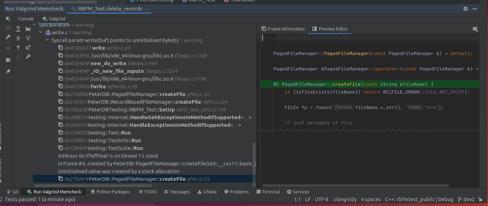

## Debugger and Valgrind Report

### 1. Basic information

### 2. Using a Debugger
- Describe how you use a debugger (gdb, or lldb, or CLion debugger) to debug your code and show screenshots. 
For example, using breakpoints, step in/step out/step over, evaluate expressions, etc. 
- 

### 3. Using Valgrind
- Describe how you use Valgrind to detect memory leaks and other problems in your code and show screenshot of the Valgrind report.
- 